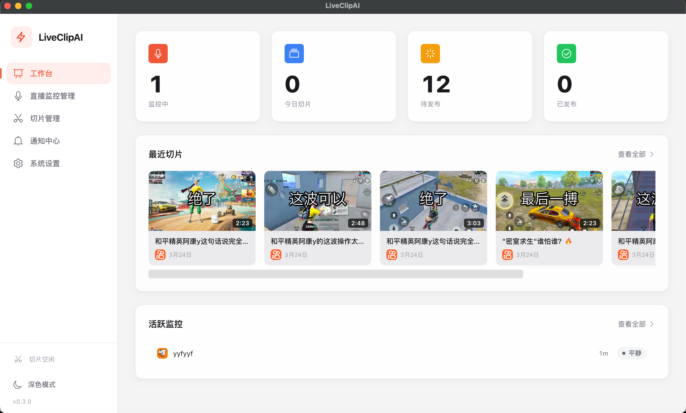
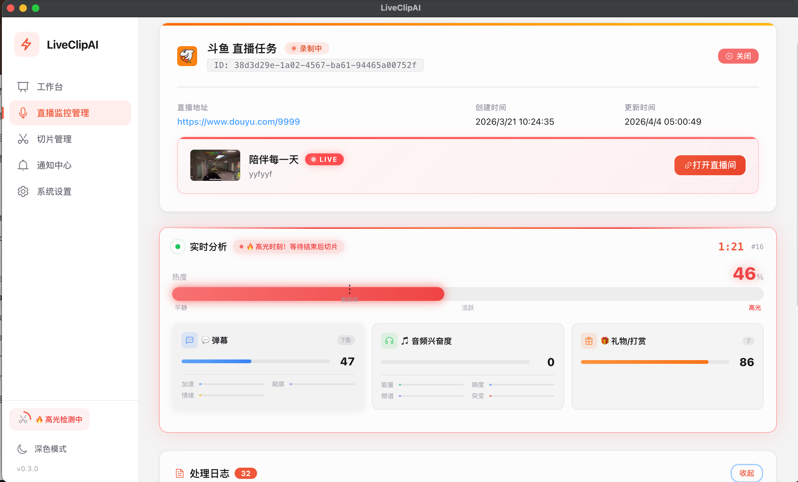
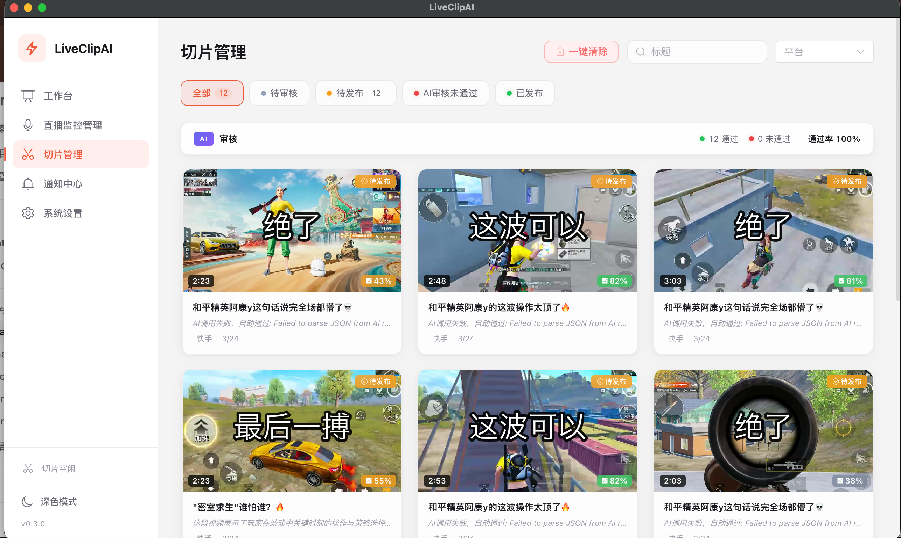

# LiveClipAI

> 跨平台 Electron 桌面应用，实时监控直播、AI 自动识别高光时刻、一键切片并发布到主流短视频平台。

[](https://www.electronjs.org/)
[](https://vuejs.org/)
[](https://www.typescriptlang.org/)
[](LICENSE)

[English](README_EN.md)

<!-- TODO: 添加截图 -->

## 截图

| 工作台 | 直播监控 | 切片管理 |
|:------:|:--------:|:--------:|
|  |  |  |

---

## 功能特点

- **多平台直播监控** — 同时监控 Bilibili、抖音、斗鱼、虎牙、快手五大平台
- **实时弹幕采集** — WebSocket 实时弹幕，弹幕密度辅助高光定位
- **三轨并行架构** — 录制轨 + 分析轨 + 切片工作轨，零间断实时处理
- **多信号 AI 评分** — 弹幕密度 + 音频能量 + ASR 关键词三维融合
- **双重确认状态机** — 连续两次超阈值才触发切片，大幅减少误切
- **本地 Whisper ASR** — 离线语音识别，数据不出本机，支持中英日多语言
- **AI 标题生成** — 兼容 OpenAI / 通义千问 / Claude / Gemini / 智谱 / Ollama 等
- **一键发布** — Playwright 自动化发布到抖音、B 站、快手
- **插件化架构** — 新增平台只需 3 个文件，无需修改核心代码

---

## 支持平台

| 平台 | 直播监控 | 弹幕采集 | 自动发布 | 弹幕协议 |
|------|:--------:|:--------:|:--------:|----------|
| Bilibili | ✅ | ✅ | ✅ | WebSocket 二进制 (brotli/zlib) |
| 抖音 | ✅ | ✅ | ✅ | WebSocket |
| 斗鱼 | ✅ | ✅ | — | WebSocket STT |
| 虎牙 | ✅ | ✅ | — | WebSocket Tars 二进制 |
| 快手 | ✅ | ✅ | ✅ | HTTP 轮询 (GraphQL) |
| YouTube | 计划中 | — | — | — |

---

## 系统架构

```
┌──────────────────────────────────────────────┐
│          LiveMonitor 三轨编排器               │
│  解析 URL → 获取直播流 + 房间号 → 启动三轨    │
└──────┬──────────────┬──────────────┬─────────┘
       │              │              │
  ┌────▼────┐   ┌─────▼─────┐  ┌────▼──────┐
  │ 录制轨   │   │  分析轨    │  │ 切片工作轨 │
  │ FFmpeg  │   │  评分引擎   │  │ 切片+ASR  │
  │ 持续录制  │   │  状态机    │  │ +AI标题   │
  └─────────┘   └───────────┘  └───────────┘
```

**爆点检测状态机：**

```
IDLE ─分数>阈值─▶ HEATING ─分数>阈值(第2次)─▶ BURST ─分数<阈值─▶ COOLING
  ▲                  │                                               │
  └──分数<阈值────────┘                                    分数<阈值(第2次)
     (虚惊，不切片)                                                   │
                                                    触发 BurstEvent ──▶ IDLE
```

---

## 快速开始

### 前置依赖

- [Node.js 18+](https://nodejs.org/)
- [FFmpeg](https://ffmpeg.org/) — macOS: `brew install ffmpeg`

### 安装

```bash
git clone https://github.com/PixelNova-Team/LiveClipAI.git
cd LiveClipAI
npm install
```

### 开发模式

```bash
npm run dev
```

### 打包

```bash
# macOS
npm run package:mac

# Windows（需先放置 FFmpeg，见下方说明）
npm run package:win
```

### Windows FFmpeg 配置

Windows 版需要手动下载 FFmpeg 静态版：

1. 从 [gyan.dev](https://www.gyan.dev/ffmpeg/builds/) 下载 `essentials` 版本
2. 将 `ffmpeg.exe` 放入 `static/ffmpeg/win/ffmpeg.exe`

macOS 使用 `ffmpeg-static` 包自动处理，无需手动操作。

---

## 配置说明

应用首次启动会自动生成配置文件。所有配置也可在应用设置页面中修改。

- macOS: `~/Library/Application Support/LiveClipAI/config.yaml`
- Windows: `%APPDATA%/LiveClipAI/config.yaml`

### AI 模型

支持任意兼容 OpenAI API 格式的提供商：

```yaml
ai:
  active_provider: qwen
  providers:
    qwen:
      base_url: https://dashscope.aliyuncs.com/compatible-mode/v1
      api_key: your-api-key
      model: qwen-plus
    openai:
      base_url: https://api.openai.com/v1
      api_key: sk-xxx
      model: gpt-4o-mini
```

### 语音识别 (ASR)

| 提供商 | 说明 | 配置 |
|--------|------|------|
| `whisper-local` | 本地 whisper.cpp，离线运行 | 默认，无需配置 |
| `volcengine` | 火山引擎流式 ASR | 需要 `app_id` + `access_token` |
| `paraformer` | 阿里 Paraformer API | 需要 `api_key` |

### 评分权重

| 配置项 | 说明 | 默认值 |
|--------|------|--------|
| `slice.danmaku_weight` | 弹幕密度权重 | `0.45` |
| `slice.audio_weight` | 音频能量权重 | `0.25` |
| `slice.ai_weight` | ASR 关键词权重 | `0.30` |
| `slice.burst_threshold` | 爆点触发阈值 (0-1) | `0.6` |
| `slice.pre_buffer` | 爆点前保留秒数 | `5` |
| `slice.post_buffer` | 爆点后保留秒数 | `3` |

---

## 项目结构

```
LiveClipAI/
├── src/
│   ├── main/                    # 主进程 (TypeScript)
│   │   ├── index.ts             # 应用入口
│   │   ├── ipc.ts               # IPC 接口层
│   │   ├── live-monitor.ts      # 三轨编排器
│   │   ├── recorder.ts          # 录制轨 (FFmpeg)
│   │   ├── scoring-engine.ts    # 多信号评分引擎
│   │   ├── burst-detector.ts    # 爆点状态机
│   │   ├── slice-worker.ts      # 切片流水线
│   │   ├── ai-client.ts         # LLM 客户端 (标题生成/评分)
│   │   ├── whisper-local.ts     # 本地 Whisper ASR
│   │   ├── auth-manager.ts      # 平台登录态管理
│   │   ├── asr/                 # ASR 多提供商
│   │   └── plugins/
│   │       ├── platform/        # 平台插件 (5 个内置)
│   │       ├── danmaku/         # 弹幕采集插件
│   │       └── publisher/       # 自动发布插件
│   ├── preload/                 # Electron preload
│   └── renderer/                # 前端 (Vue 3 + Element Plus)
├── plugins.config.json          # 插件注册 + 平台配置
├── electron-builder.yml         # 打包配置
└── package.json
```

---

## 插件开发

LiveClipAI 支持三类插件：平台（Platform）、弹幕采集（Danmaku）、发布（Publisher）。

### 添加新平台（三步）

**1. 实现平台插件** — `src/main/plugins/platform/<name>.ts`

```typescript
import type { PlatformPlugin, LiveInfo } from './types'

export const mysitePlatform: PlatformPlugin = {
  name: 'mysite',
  label: 'My Site',
  icon: 'mysite',

  validateUrl: (url) => url.includes('mysite.com'),
  getLiveInfo: async (url): Promise<LiveInfo> => { /* ... */ },
  getStreamUrl: async (url): Promise<string> => { /* ... */ },
  isLive: async (url): Promise<boolean> => { /* ... */ },
  getLoginUrl: () => 'https://mysite.com/login',
  getHeaders: () => ({}),
}
```

**2. 实现弹幕插件** — `src/main/plugins/danmaku/<name>.ts`（实现 `DanmakuCollector` 接口）

**3. 注册插件** — 在 `plugins.config.json` 和 `src/main/plugins/loader.ts` 中添加映射

---

## 技术栈

| 层级 | 技术 |
|------|------|
| 桌面框架 | Electron 33, electron-vite |
| 前端 | Vue 3, TypeScript, Element Plus |
| 主进程 | TypeScript, Node.js |
| AI/ASR | whisper.cpp (本地), OpenAI 兼容 API |
| 音视频 | FFmpeg, ffmpeg-static |
| 弹幕采集 | WebSocket (ws), Tars 协议 |
| 存储 | SQLite (better-sqlite3), YAML |
| 自动发布 | Playwright |
| 国际化 | vue-i18n (中文/English) |

---

## 注意事项

- **自动发布** 基于 Playwright 浏览器自动化，需先通过应用内浏览器登录各平台账号
- **本地 Whisper** 首次使用会下载模型文件（`base` 约 145MB），请确保网络通畅
- **虎牙弹幕** 使用 BrowserWindow 方式采集，需要已登录虎牙账号
- 评分权重在信号不可用时**自动重新分配**（如无弹幕 → 音频 + ASR 分摊权重）

---

## 贡献

1. Fork 本仓库
2. 创建特性分支：`git checkout -b feature/your-feature`
3. 提交 Pull Request

---

## 许可证

[Apache License 2.0](LICENSE)
